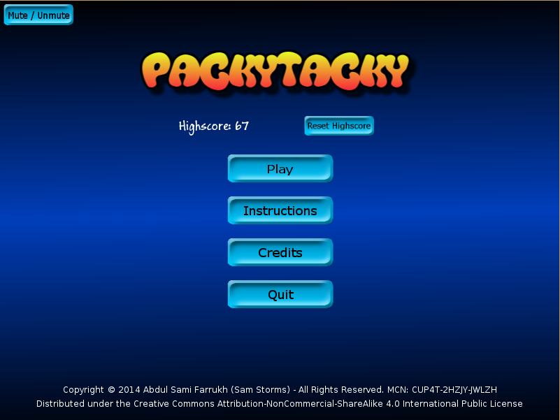
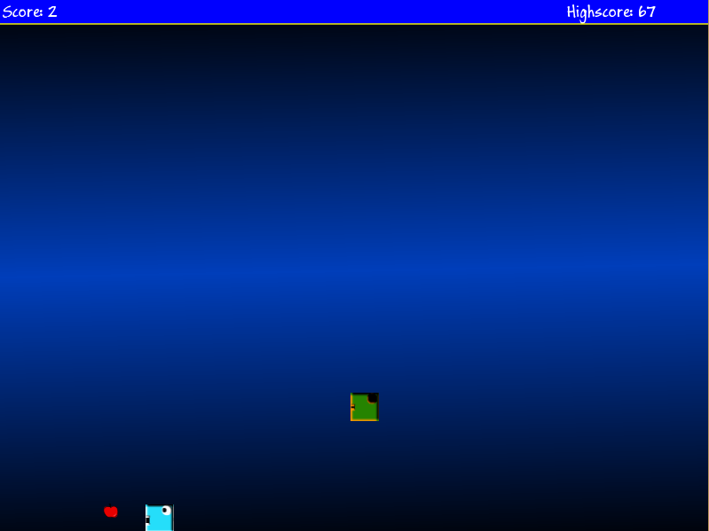
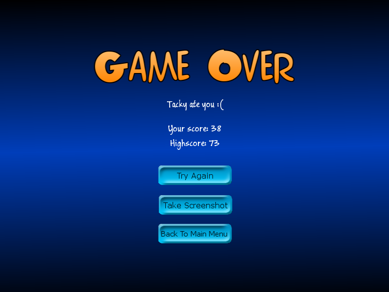

PackyTacky
==========

A simple game made in Lua with the Love2D framework (0.9.1).

PackyTacky is a simple 2D game in which the player controls a square shaped character that has to move around and eat red squares to increase the score. There is also an enemy character which looks similar to the player's character but is different in color. He is attracted towards the food. If the enemy character eats the food, the score decreases. If the enemy eats the player character, the game ends.

Please note that this is a work in progress. This is just my implementation of the idea. There is much room for improvement and additions.

This game is distributed under the Creative Commons Attribution-NonCommercial-ShareAlike 4.0 International Public License. In summary, it means you can copy and redistribute this game or remix, transform or build upon it after giving all due credits. You must not use this game or any of its material for commercial purposes. Upon redistribution of this or a remix or transformed version of this game, you must share it with the same license and give due credit.

As of yet, the game has been released for Windows 32 and 64 bits, and Mac OSX (Credits go to Eamonn Rea https://github.com/sonic2kk)

Download The Game:
----
To play the game, you can download the binaries for Windows 32 bit at http://goo.gl/lqxNU4 and for Windows 64 bit at http://goo.gl/WhSEpL

Download for Mac OSX: http://goo.gl/sjEb8A

Screenshots:
----

